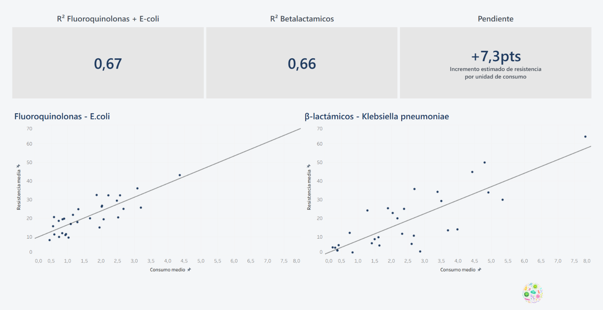
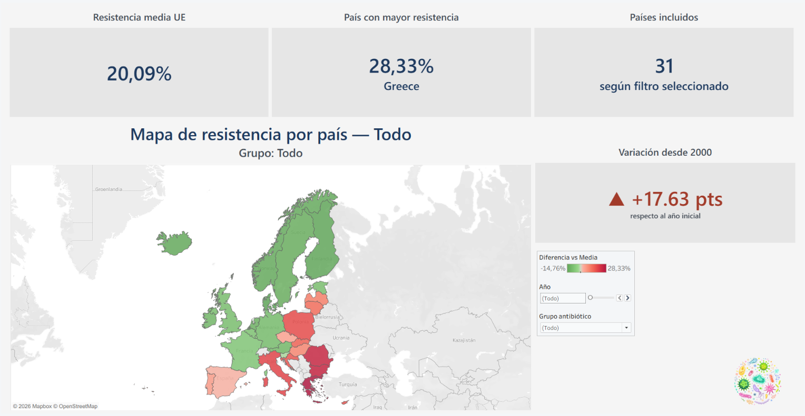
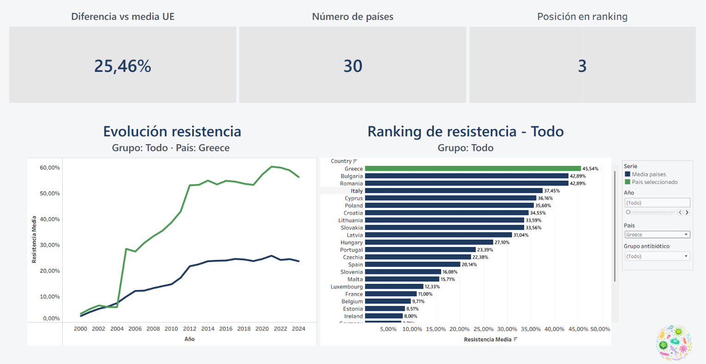
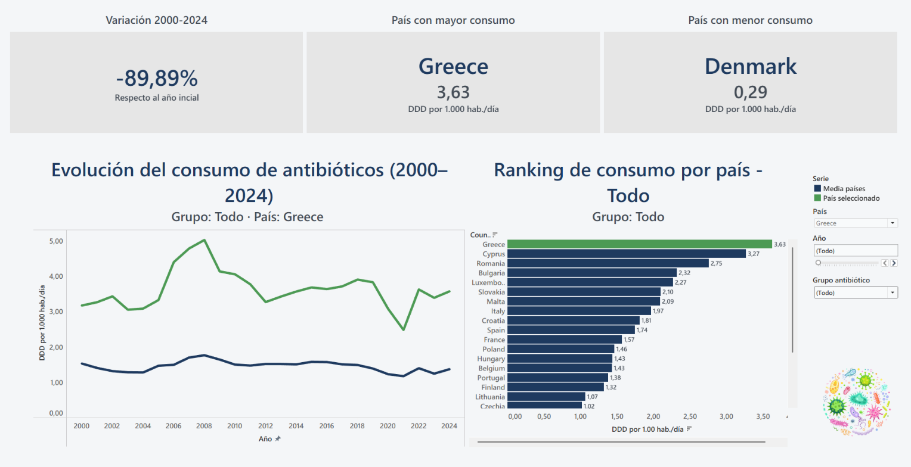
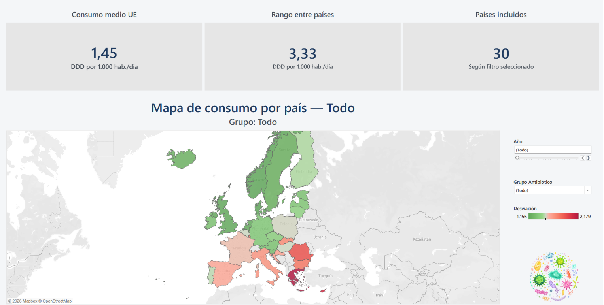
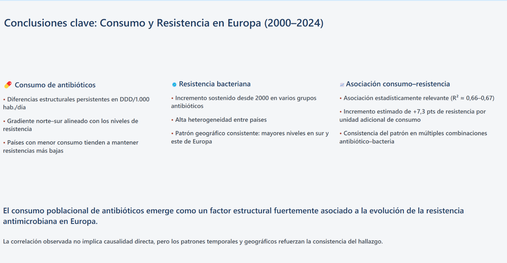

# Consumo de antibióticos y resistencia bacteriana en Europa (2000–2024)

    

Proyecto académico del módulo 4 del **Bootcamp de Data Analytics & IA de Adalab**, en equipo de dos personas.



---

## Resumen del proyecto

- **Pregunta:** ¿los países que consumen más antibióticos tienen más bacterias resistentes?
- **Datos:** ECDC (Centro Europeo para la Prevención y el Control de Enfermedades). Consumo de tres grupos de antibióticos (J01D β-lactámicos, J01G aminoglucósidos, J01M fluoroquinolonas) y resistencia de *E. coli*, *K. pneumoniae* y *Acinetobacter* spp. en 31 países de la UE/EEE y Reino Unido.
- **Resultado:** en las dos combinaciones analizadas, los países con más consumo medio tienen más resistencia media: R² = 0,67 en *E. coli*–fluoroquinolonas y 0,66 en *K. pneumoniae*–β-lactámicos. La resistencia es menor en el norte de Europa y mayor en el sur y el este.
- **Limitaciones:** datos agregados por país, así que muestran asociación y no causa; la cobertura de países y bacterias cambia con los años.

---

**📌 Mi contribución en este proyecto**  
Analicé, limpié y uní los datos de consumo de antibióticos (`notebooks/01_…`), integré consumo y resistencia en un único dataset (`notebooks/03_…`) y diseñé los dashboards de consumo y de relación consumo–resistencia en Tableau. Camila López descargó y preparó los datos de resistencia (`notebooks/02_…`) y diseñó los dashboards de resistencia.

---

## Autoras

**Camila López**

[](https://github.com/camilalopezmrt)
[](https://www.linkedin.com/in/camila-adriana-lopez-martin)

**Nieves Sánchez**

[](https://github.com/nieves-sanchez)
[](https://www.linkedin.com/in/nieves-sanchez-data)
[](mailto:nsanchezgarcia86@gmail.com)

---

## Dashboards en Tableau

Capturas del libro `proyecto-conjunto.twbx`. Filtros en «Todo», salvo el país resaltado (Grecia).

### Resistencia por país



Mapa de la resistencia media de cada país frente a la media del conjunto, con la variación desde el año 2000.

### Evolución y ranking de resistencia



Evolución anual del país seleccionado frente a la media y ranking de países por resistencia media.

### Evolución y ranking de consumo



Evolución del consumo del país seleccionado frente a la media y ranking de países.

### Consumo por país



Consumo medio de cada país en DDD por 1.000 habitantes y día, y su desviación respecto a la media.

### Relación consumo–resistencia


Un punto por país (consumo medio frente a resistencia media de todo el periodo) con su línea de tendencia.

### Conclusiones



---

## Por qué solo dos combinaciones

No todos los antibióticos se usan contra todas las bacterias. Para la correlación elegimos las dos parejas en las que ese grupo de antibióticos es de uso habitual frente a esa bacteria: fluoroquinolonas con *E. coli* y β-lactámicos con *K. pneumoniae*. En las demás combinaciones la relación es débil o no tiene sentido buscarla.

La pendiente de *K. pneumoniae*–β-lactámicos es de +7,3 puntos de resistencia por cada DDD/1.000 hab./día de consumo.

---

## Hallazgos

- En *E. coli*–fluoroquinolonas y *K. pneumoniae*–β-lactámicos, el consumo medio de cada país explica en torno a dos tercios de la variación de su resistencia media (R² ≈ 0,66–0,67).
- La resistencia media va del 3,5 % de Finlandia al 45,5 % de Grecia. Los países nórdicos y los Países Bajos están abajo; Grecia, Bulgaria, Rumanía e Italia, arriba.
- Grecia es el país con más consumo medio (3,63 DDD/1.000 hab./día) y Dinamarca el que menos (0,29).

---

## Cobertura de los datos

| Serie | Años | Nota |
|---|---|---|
| Consumo (J01D, J01G, J01M) | 2000–2024 | 14 países con datos en 2000 y 27 en 2024; Liechtenstein sin datos de consumo |
| *E. coli* | 2000–2024 | |
| *K. pneumoniae* | 2005–2024 | |
| *Acinetobacter* spp. | 2012–2024 | |

Como el número de países y de bacterias cambia con los años, las medias anuales y las variaciones desde 2000 comparan grupos distintos de países. Por eso las conclusiones se basan en medias por país y no en la tendencia temporal.

---

## Estructura del repositorio

```text
.
├── README.md
├── proyecto-conjunto.twbx          # libro de Tableau con los dashboards
├── assets/                         # capturas de los dashboards
├── data/
│   ├── raw/                        # CSV originales del ECDC
│   └── processed/                  # consumo, resistencia y dataset integrado
└── notebooks/
    ├── 01_union_eda_limpieza_consumo_antibioticos.ipynb
    ├── 02_union_eda_limpieza_resistencia_bacterias.ipynb
    └── 03_integracion_consumo_resistencia.ipynb
```

---

## Cómo reproducirlo

```bash
git clone https://github.com/nieves-sanchez/antibiotic-resistance-eu-tableau.git
cd antibiotic-resistance-eu-tableau
pip install -r requirements.txt
jupyter notebook notebooks/
```

Ejecuta los notebooks en orden (01 → 02 → 03). El libro `proyecto-conjunto.twbx` se abre con Tableau Desktop o Tableau Reader.

---

Fuente de datos: [ECDC](https://www.ecdc.europa.eu/) · Proyecto con fines educativos, parte del Bootcamp de Data Analytics & IA de Adalab.
